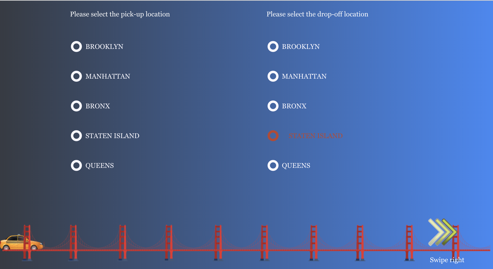
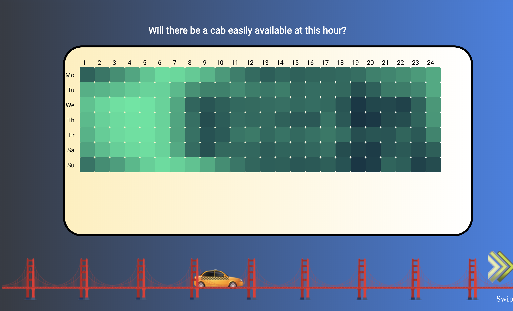
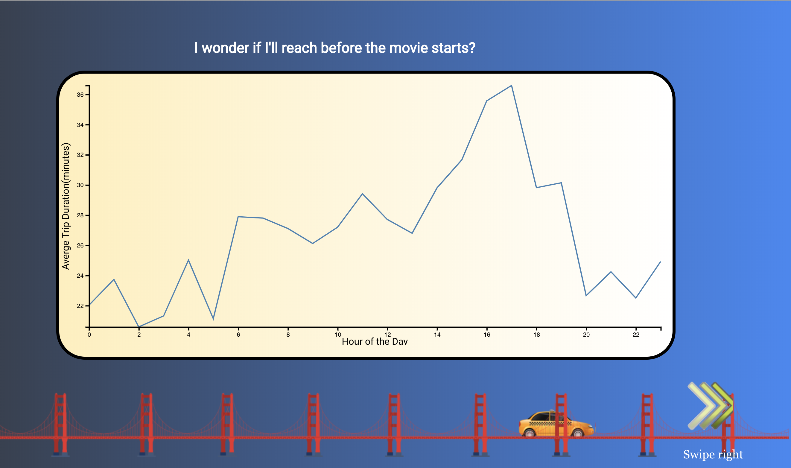
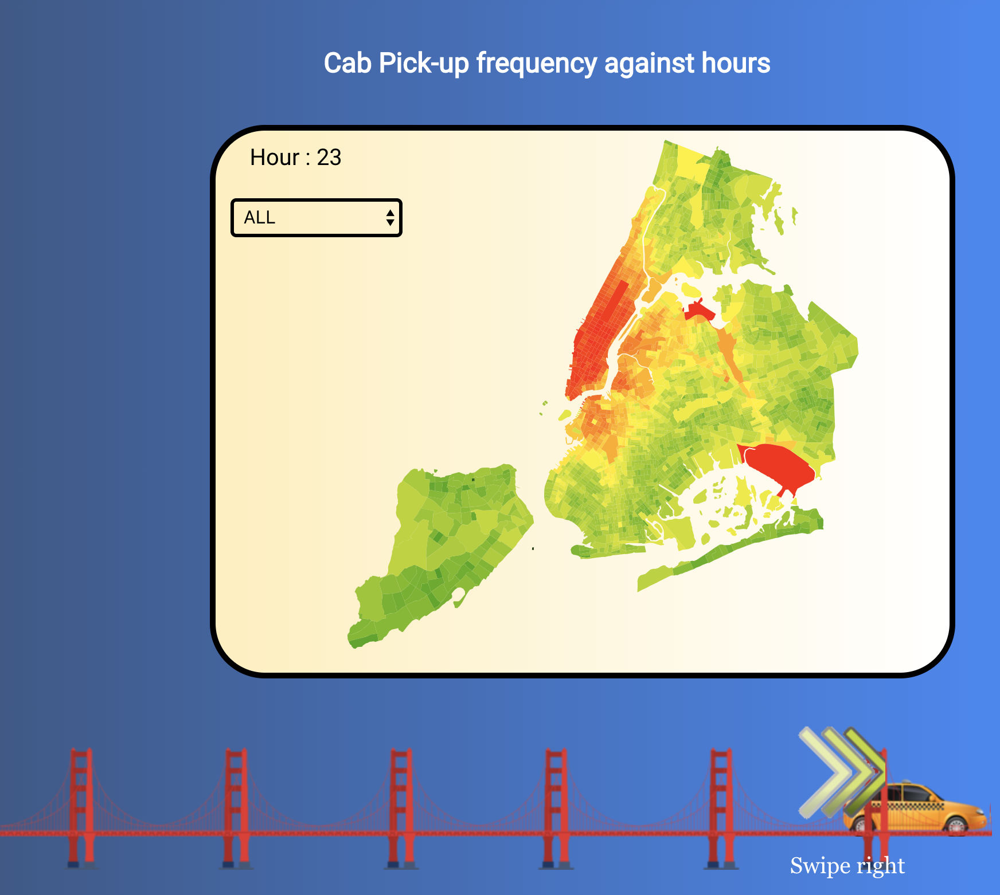

# NYC Cab Data Visualization
**Authors**: Arun Kodnani (ak6384), Pranav Reddy Mandala (pm2696), Rahul Keshwani (ryk248)
Group 10 (Online: Group 10) 

## About
As we know public transportation is one of the most important part of New York City, through this data visualization project we aim at analysing the yellow cabs data provided by NYC Open Data source and generate visualizations that would help a New York cab rider to make a decision of whether to take a cab or prefer using the subway.

## Our solution
### 1) Filter to add interactivity

### 2) Data visualizations

## More
[DEMO](https://nyu-vis-fall2018.github.io/storytelling-group-10-nyc-cab-data-visualization/)

[Project Description](https://github.com/NYU-VIS-FALL2018/storytelling-group-10-nyc-cab-data-visualization/blob/master/NYC-CabDataVisualization-ProjectReport.pdf)
